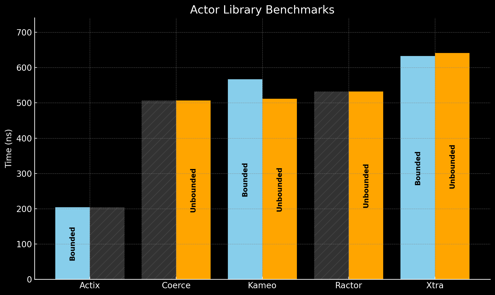

# Actor Benchmarks for Rust Libraries

Welcome to the **Actor Benchmarks** repository! This repository contains comprehensive benchmarks comparing the performance and features of popular Rust actor libraries, including **Actix**, **Coerce**, **Kameo**, **Ractor**, and **Xtra**.

## Benchmark Overview

The benchmarks focus on two key performance metrics:

1. **Actor Messaging Time**: Measures the time taken to send a fire-and-forget ("tell") message across multiple actors in a round-robin setup.
2. **Actor Spawn Time**: Measures the time required to create and initialize actors.

Additionally, a detailed feature comparison table is included to highlight the capabilities of each library.

## Results

### Actor Messaging Time (Lower is Better)



### Actor Spawn Time (Lower is Better)


## Feature Comparison

| **Feature**                    | **Actix** | **Coerce** | **Kameo** | **Ractor** | **Xtra**                                |
|--------------------------------|----------:|-----------:|----------:|-----------:|-----------------------------------------:|
| Bounded Mailboxes              |     ✅    |     ❌     |     ✅    |     ❌     |     ✅                                  |
| Unbounded Mailboxes            |     ❌    |     ✅     |     ✅    |     ✅     |     ✅                                  |
| Ask Requests (Message + Reply) |     ✅    |     ✅     |     ✅    |     ✅     |     ✅                                  |
| Tell Requests (Fire and Forget)|     ✅    |     ✅     |     ✅    |     ✅     |     ✅                                  |
| Supervision                    |     ✅    |     ✅     |     ✅    |     ✅     |     ❌                                  |
| Distributed Actors             |     ❌    |     ✅     |     ✅    |     ✅     |     ❌                                  |
| Runtime Used                   |   Actix   |   Tokio    |   Tokio   |   Tokio    | Async Std / Smol / Tokio / wasm-bindgen |
| Latest Release                 |  Jun, 2024 |  Oct, 2023 |  Jan, 2025 |  Jan, 2025 |  Feb, 2024                              |

## Benchmarked Libraries

1. **Actix**: A mature actor framework with its own runtime.
2. **Coerce**: A distributed actor framework built on Tokio.
3. **Kameo**: A versatile actor library supporting local and distributed systems.
4. **Ractor**: A lightweight actor library with custom patterns for distributed systems.
5. **Xtra**: A flexible library that supports multiple runtimes, including Async Std and Tokio.

## Repository Structure

```plaintext
.
├── benches/       # Criterion benchmark files
│   ├── actix.rs   # Benchmarks for Actix
│   ├── coerce.rs  # Benchmarks for Coerce
│   ├── kameo.rs   # Benchmarks for Kameo
│   ├── ractor.rs  # Benchmarks for Ractor
│   └── xtra.rs    # Benchmarks for Xtra
├── Cargo.toml     # Dependency management
└── README.md      # Project documentation
```

## Running the Benchmarks

To reproduce the benchmarks:

1. **Clone the Repository**
   ```bash
   git clone https://github.com/tqwewe/actor_benchmarks.git
   cd actor_benchmarks
   ```

2. **Install Rust** (if not already installed)
   Use [rustup](https://rustup.rs) to install the latest stable version of Rust.

3. **Run the Benchmarks**
   ```bash
   cargo bench
   ```

## Contributing

Contributions are welcome! If you have ideas for improving the benchmarks, or if you’d like to test additional actor libraries, feel free to open an issue or submit a pull request.

## Acknowledgments

Special thanks to the maintainers of Actix, Coerce, Kameo, Ractor, and Xtra for their contributions to the Rust ecosystem. Their work enables developers to build efficient and scalable concurrent systems.

---

For more details about the benchmarking methodology and results, check out the related blog post: [Comparing Rust Actor Libraries](https://theari.dev/blog/comparing-rust-actor-libraries).

